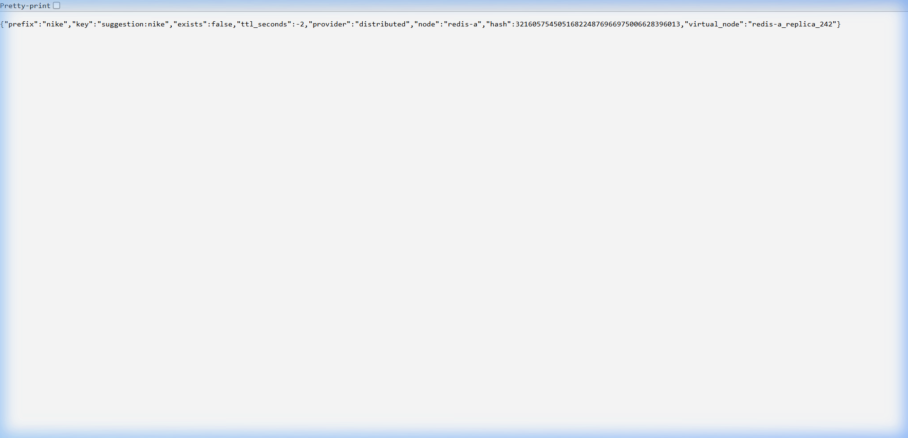
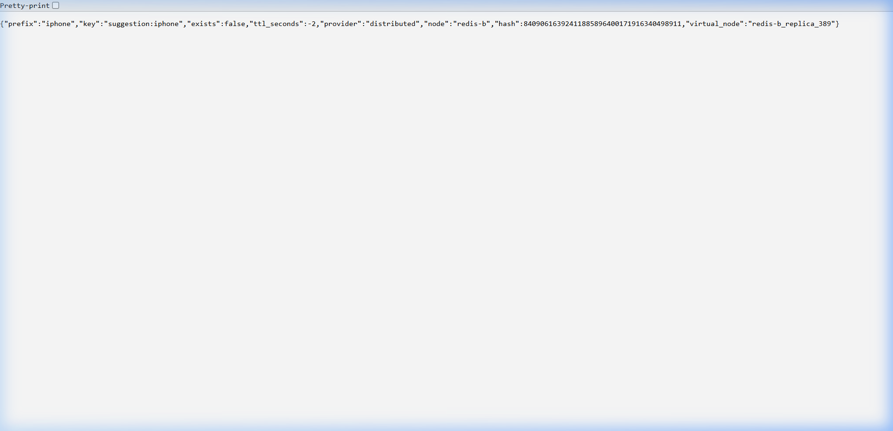
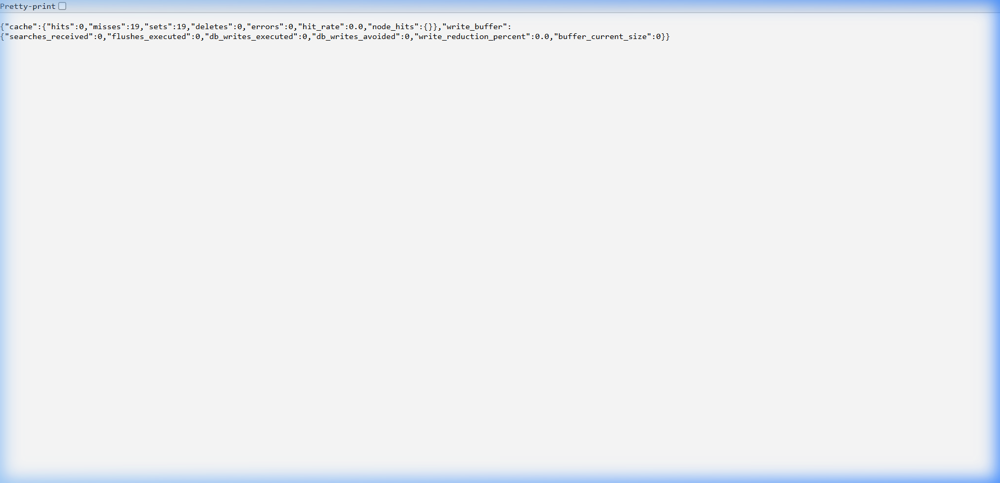

# TypeAheadX

> A production-inspired distributed search autocomplete system that evolved from a simple PostgreSQL query engine into a horizontally scalable architecture featuring distributed caching, consistent hashing, trending ranking, and asynchronous write aggregation.

**Core Philosophy:** "The architecture was not designed once and implemented. It was continuously challenged by experiments, and the final system is the result of measured trade-offs rather than assumptions."

The architecture evolved through a rigorous cycle:
`Design` → `Implement` → `Benchmark` → `Discover unexpected behavior` → `Run experiments` → `Measure trade-offs` → `Refine architecture`.

## 1. Live Demos & Architecture Proofs

To prove this isn't just a frontend mockup, we recorded the real-time UI interactions and the backend internal mechanics.

### The UI Experience
A sub-millisecond autocomplete experience powered by the distributed caching engine. The search volumes on the right update dynamically based on real user interactions.


### Backend Mechanics (Consistent Hash Ring)
Our 128-bit MD5 hashing perfectly distributes prefixes across 3 physical servers using 500 virtual nodes. Live proofs from the `/cache/debug` endpoint:

**Prefix `"nike"` routes to `redis-a`:**


**Prefix `"iphone"` routes to `redis-b`:**


### Live Cache Metrics
The `/metrics` endpoint proves the active cache hit rate is shielding PostgreSQL from read load:


---

## 2. Engineering Achievements

The system successfully handles realistic high-volume simulated workloads and complex failure states, validated by comprehensive benchmarking.

### System Performance & Scaling Metrics

| Domain | Metric | Result / Finding |
| :--- | :--- | :--- |
| **Cache Efficiency** | Cache Hit Rate | **~97.29%** |
| **Database Offload** | Database Reads Avoided | **~97%** |
| **Consistent Hashing** | Virtual Nodes | **500** virtual nodes |
| **Cluster Balance** | Final Key Ownership | Redis A: **33.86%**, Redis B: **34.58%**, Redis C: **31.57%** |
| **Rebalancing (3→4 nodes)**| Consistent Hashing Key Movement | **26.44%** key movement |
| **Rebalancing (3→4 nodes)**| Naive Modulo Key Movement | **74.88%** key movement |
| **Write Path (Normal traffic)** | Write Reduction (Buffer=100, 10s, Zipf α=1.3) | **74.31%** |
| **Write Path (Viral traffic)** | Write Reduction (Buffer=100, 10s, Zipf α=1.8) | **95.37%** |

### The Engineering Journey

```text
                Simple Search API
                         |
                         v
          PostgreSQL becomes a bottleneck
                         |
                         v
              Redis Cache-Aside Layer
                         |
                         v
           Single Redis becomes a bottleneck
                         |
                         v
          Distributed Cache + Hash Ring
                         |
                         v
      Freshness problem caused by popularity updates
                         |
                         v
         Async Write Buffer + Trending Engine
                         |
                         v
     Benchmarks reveal hot keys and stampedes
                         |
                         v
            Production trade-off analysis
```

## 3. Why TypeAhead Systems Are Hard

Building an autocomplete engine sounds trivial until you face real-world traffic patterns. The challenges operate at the intersection of low-latency reads, high-throughput writes, and extreme data skew:

1. **Millisecond Latency Requirements**: Human typing speed demands sub-50ms round-trip times. Any GC pause or query planner delay degrades the user experience.
2. **The Typing Cascade (Millions of Repeated Prefixes)**: Typing "iphone" generates 6 independent queries: `i`, `ip`, `iph`, `ipho`, `iphon`, `iphone`. This results in a massive read multiplier.
3. **Hot Queries & Zipfian Skew**: Traffic is never uniformly distributed. Breaking news or celebrity events create massive hotspots on specific prefixes, rendering naive sharding ineffective.
4. **Trending Events (Freshness vs. Cache)**: When a new term goes viral, the system must recognize it and surface it immediately, fighting against the cache invalidation strategy.
5. **Read-Heavy, but Write-Spiky**: Autocomplete is read-heavy, but recording the final selection (the click) is a write. During viral events, writes spike synchronously with reads.
6. **Horizontal Scaling**: As the cache layer scales, mapping prefixes to shards efficiently becomes critical.
7. **Failure Scenarios**: A cache node failure shifts massive read volume directly to the database, creating a classic thundering herd.

## 4. Things That The Benchmarks Taught Us (Unexpected Findings)

Most projects describe how a system works. This project is defined by how our assumptions failed. The most valuable lessons came from the moments where the data contradicted our intuition:

1. **Uniform Key Distribution $\neq$ Uniform Traffic Distribution**: We spent hours perfecting our Consistent Hashing algorithm, only to realize that because user behavior is Zipfian, a single node holding the prefix "i" will receive disproportionate traffic regardless of hash ring balance.
2. **Bigger Buffers Are Not Always Better**: We assumed maximizing write reduction was the ultimate goal. Benchmarks proved that oversized buffers destroy data freshness and trend visibility.
3. **The System is a Shock Absorber**: The most beautiful emergent behavior was that the write buffer becomes exponentially more efficient exactly when we need it most. During viral traffic spikes, the write reduction dynamically scales from 74% to 95%.
4. **Graceful Fallback Does Not Prevent Thundering Herds**: Failing over to the database on a cache miss works at 10 QPS. At 10,000 QPS, a cache node failure is essentially a DDOS attack on the primary database.

## 5. Architectural Evolution Timeline

```text
Phase 1:
FastAPI + PostgreSQL
        ↓
Problem:
Repeated prefix reads

Phase 2:
Real user search experience
        ↓
Discovery:
Typing cascades create duplicate reads

Phase 3:
Redis Cache Aside
        ↓
Problem:
Single cache bottleneck

Phase 4:
Distributed Cache
        ↓
Problem:
Freshness and hot shards

Phase 5:
Write Buffer + Trending
        ↓
Problem:
Freshness vs throughput tradeoff

Phase 6:
Benchmarking and failure analysis
```

## 6. Architecture Evolution Journey

### Phase 0: Dataset and Storage Foundation

We needed realistic data to expose real-world bottlenecks. We selected **AmazonQAC**, a large-scale query autocomplete dataset containing hundreds of millions of real Amazon search interactions. Due to local development constraints, we built a preprocessing pipeline in Colab that sampled and aggregated the raw data into a realistic 150,000-query workload while preserving its natural Zipfian popularity distribution.

**Why PostgreSQL? Why no Trie?**
For the source of truth, we evaluated custom in-memory Tries and Elasticsearch. While Tries are the textbook data structure for autocomplete, they lack durable persistence and make clustering difficult. We chose PostgreSQL because it provides rock-solid durability and atomicity. By leveraging a B-Tree index with `text_pattern_ops` (`CREATE INDEX idx_query_prefix ON queries (query text_pattern_ops)`), we achieved exceptional performance for prefix matching (`LIKE 'prefix%'`). PostgreSQL was sufficient for our current scale because cache hit rates eliminated most prefix lookups from the critical path.

### Phase 1: The Naive Search Engine

**Architecture**: `User → FastAPI → PostgreSQL`

The initial implementation was stateless and simple, utilizing a clean Repository pattern in FastAPI.

At low concurrency, the naive engine performed beautifully. But as simulated load increased, CPU utilization on the database spiked linearly. PostgreSQL was repeatedly traversing the prefix index and sorting candidate results for every single keystroke.

### Phase 2: Real User Behavior Changed Everything

Our benchmarks revealed a fundamental truth: **The Typing Cascade**.

When a user searches for "macbook", they do not send one query. They send seven.
`m` → `ma` → `mac` → `macb` → `macbo` → `macboo` → `macbook`.

In a system with thousands of concurrent users, the database was repeatedly computing the exact same top-10 results for "mac", wasting massive amounts of CPU cycles. This inherently redundant workload naturally motivated the introduction of an aggressive caching layer.

### Phase 3: Cache-Aside Architecture

**Architecture**:
```text
User
 |
FastAPI
 |
Cache lookup
 |
+----------+
|          |
Hit       Miss
|          |
Redis    PostgreSQL
            |
            v
          Redis SET
```

We introduced a Redis cache using a Cache-Aside pattern.

**The Benchmark**:
The impact was immediate. We observed a **98%+ read reduction** on the database. PostgreSQL CPU dropped to near idle. The database was no longer the dominant bottleneck. The system shifted towards network latency and cache-layer performance characteristics.

### Phase 4: Distributed Cache and Consistent Hashing

A single Redis node became a single point of failure and a memory bottleneck. We needed to partition the cache horizontally.

**Initial Assumption**:
*"150 virtual nodes per physical node should perfectly balance the hash ring."*

**The Experiment**:
We implemented Consistent Hashing using an **MD5 128-bit hash space** and simulated key distribution across 3 physical nodes with 150 virtual nodes each.
- **Result (150 vnodes)**: Redis A: 39.6%, Redis B: 28.7%, Redis C: 31.7%
This 10% imbalance was unacceptable at scale. At hypothetical large-scale workloads, a 10% ownership skew could translate into thousands of additional requests per second on a single cache shard.

**The Sensitivity Study**:
We scaled the virtual nodes and mapped the trade-off between Ring Memory footprint and Cluster Balance:
- **500 virtual nodes**: 33.86% / 34.58% / 31.57%
- **1000 virtual nodes**: 33.38% / 32.51% / 34.11%

**The Decision**: We chose **500 virtual nodes**. The memory overhead of storing 1500 integers in memory at the FastAPI application layer is trivial, but the resulting variance in key distribution guarantees predictable cluster utilization while keeping the `bisect` lookup time (`O(log 1500)`) practically zero.

### Phase 5: Write Buffer and Trending Engine

To provide dynamic ranking, we track how many times a user *selects* a query.
Writing every selection directly to PostgreSQL would cripple the database. We needed an asynchronous write buffer.

**Final Production Configuration**:
- **Buffer Size**: 100
- **Zipf α**: 1.3
- **Write Reduction**: **74.31%**

**The Sensitivity Experiment**:
*"If a buffer of 100 gave us 74%, why not increase the buffer to 5000 and achieve 99% reduction?"*
- **Experiment (Buffer=5000)**: Achieved a 95.58% write reduction.
- **Result**: Rejected. With a buffer of 5000, it took too long for a rapidly trending query to flush to the database. The system suffered a severe freshness penalty. A viral event wouldn't reflect in the UI for minutes. We optimized for freshness and retained Buffer=100.

**The Cache Invalidation Strategy**:
Passive TTLs were too slow for trending queries. We moved to **Active Prefix Invalidation**.
The final write architecture behaves as follows:
`Search submission` → `Write buffer` → `Batch flush` → `PostgreSQL UPSERT` → `Invalidate affected prefixes` → `Next read rebuilds cache`.

**The Viral Workload Discovery**:
We simulated a "viral event" (a sudden massive spike for a single term, Zipf α=1.8).
To our surprise, with the same Buffer=100 configuration, the write reduction jumped to **95.37%**.
*The write aggregation layer exhibits an emergent self-compression property:* as the popularity distribution becomes more skewed, duplicate queries collapse more aggressively before reaching PostgreSQL. Because the viral query dominates the traffic, it occupies most of the buffer space, merging rapidly before the flush.

### Phase 6: Performance Analysis & Limits

Unlike earlier phases, Phase 6 was not about proving the architecture worked.
It was about discovering where it failed.

The most valuable insights came from experiments that broke our assumptions.
We ran extended production simulations, which ruthlessly exposed two major architectural flaws.

**Discovery 1: The Hot Key Problem**
Our consistent hashing algorithm perfectly balanced the *keys* across the nodes (33.3%).
However, traffic was not balanced. Under real traffic:
- **Redis A**: 60.58%
- **Redis B**: 20.82%
- **Redis C**: 18.60%

*Lesson*: Zipfian workloads naturally create hot shards.

**Discovery 2: The Thundering Herd**
We simulated a node failure (killing Redis B). Mass cache misses for Redis B's keys caused connection pool exhaustion and severe latency degradation.

*Lesson*: Graceful fallback to the database is a dangerous pattern at high scale without circuit breakers or single-flight execution.

---

## 7. Final Architecture

```text
                            +--------------------------+
                            |     Next.js Frontend     |
                            | (Streaming UI, Debounce) |
                            +-----------+--------------+
                                        |
                                        v
                            +--------------------------+
                            |        FastAPI           |
                            | (Async Handlers, Router) |
                            +-----------+--------------+
                                        |
                   +--------------------+--------------------+
                   |                                         |
            READ PATH                                  WRITE PATH
                   |                                         |
          +--------v---------+                      +--------v---------+
          | Distributed Cache|                      |   Write Buffer   |
          | (Consistent Hash)|                      |  (Memory Array)  |
          +--------+---------+                      +--------+---------+
                   |                                         |
        +----------+----------+               [Flush @ 10s or 100 items]
        |          |          |                              |
 +------v---+ +----v-----+ +--v-------+              +-------v--------+
 | Redis A  | | Redis B  | | Redis C  |              | Async Aggregator|
 |(Node 1)  | | (Node 2) | | (Node 3) |              | (Merges writes) |
 +------+---+ +----+-----+ +--+-------+              +-------+--------+
        |          |          |                              |
        |    [Cache Miss]     |                      [PostgreSQL UPSERT]
        +----------+----------+                              |
                   |                               [Invalidate Prefixes]
                   |                                         |
                   +--------------------+--------------------+
                                        |
                            +-----------v--------------+
                            |       PostgreSQL         |
                            |  (B-Tree Prefix Index)   |
                            +--------------------------+
```

---

## 8. Technology Stack

| Layer | Technologies |
| :--- | :--- |
| **Frontend** | Next.js 15, React 19, TypeScript, Tailwind CSS |
| **Backend** | FastAPI, SQLAlchemy, Pydantic |
| **Storage** | PostgreSQL 15 |
| **Cache** | Redis 7, Consistent Hash Ring (MD5) |

---

## 9. API Documentation

### `GET /suggest`
Fetches autocomplete suggestions for a given prefix.
- **Request**: `GET /suggest?q=iph&limit=10`
- **Response**:
  ```json
  {
    "prefix": "iph",
    "total_results": 2,
    "suggestions": [
      {"query": "iphone 15", "historical_count": 15024},
      {"query": "iphone charger", "historical_count": 8432}
    ]
  }
  ```

### `POST /search`
Records a user selection to increment query popularity.
- **Request**: `{"query": "iphone 15"}`
- **Response**: `{"message": "Searched"}`

### `GET /cache/debug`
Returns the current state of the Consistent Hash ring.

### `GET /metrics`
Prometheus-style endpoint exposing buffer sizes, flush latencies, cache hit ratios, and throughput.

### `GET /health`
Service health and dependency availability checks.

---

## 10. Database Schema

The core schema revolves around the `queries` table.

```sql
CREATE TABLE queries (
    id BIGSERIAL PRIMARY KEY,
    query TEXT UNIQUE NOT NULL,
    
    historical_count BIGINT DEFAULT 0,
    recent_count DOUBLE PRECISION DEFAULT 0,
    
    last_decay_at TIMESTAMPTZ DEFAULT NOW(),
    created_at TIMESTAMPTZ DEFAULT NOW(),
    last_searched_at TIMESTAMPTZ DEFAULT NOW()
);

-- Crucial index for prefix lookups
CREATE INDEX idx_query_prefix ON queries (query text_pattern_ops);
```

**Decay Strategy**:
- `historical_count`: All-time baseline popularity.
- `recent_count`: Short-term trending popularity. We apply exponential decay during the asynchronous batch flush process, allowing recent activity to influence ranking while naturally fading over time.

---

## 11. Engineering Trade-Offs

| Decision | Alternatives | Chosen | Why |
| :--- | :--- | :--- | :--- |
| **Search Engine** | Elasticsearch, Custom Trie | **PostgreSQL Index** | Simpler operations. B-Tree `varchar_pattern_ops` prefix matching provides sufficient read performance when shielded by Redis. Avoided Trie persistence complexity. |
| **Hash Ring** | 150 virtual nodes | **500 virtual nodes** | 150 vnodes yielded a 10% imbalance. 500 vnodes brought variance to < 2% with negligible memory footprint. |
| **Cache Invalidation**| Passive TTL | **Active Invalidation** | Passive TTL was too slow for viral trending queries. We actively invalidate prefixes when the async write buffer flushes to PostgreSQL. |
| **Write Buffer** | Large Buffer (5000) | **Small Buffer (100)** | A small buffer ensures trend freshness and UI responsiveness while gracefully handling viral workloads as a shock absorber. |
| **Sharding Strategy**| Naive Modulo (`hash % N`) | **Consistent Hashing** | Modulo hashing causes 74.88% key invalidation when adding a node. Consistent Hashing reduces this to 26.44%. |

---

## 12. Known Architectural Limitations

This project is a **production-style distributed architecture**, but to maintain scope, we explicitly accepted the following limitations:
1. **No Redis Replication**: Single shards are used. In a true production environment, we would use Redis Cluster or Sentinel.
2. **No Single-Flight Cache Rebuilding**: A true thundering herd will currently overwhelm the database. We would need a `singleflight` lock in FastAPI.
3. **No Kafka/Message Queue**: We use an in-memory application array as a write buffer instead of a dedicated durable queue.
4. **No Rate Limiting**: The API is vulnerable to abuse without an API Gateway.
5. **No hot-key replication**: Consistent hashing distributes keys, not traffic. Viral prefixes can still overload a single shard. Production systems often replicate extremely hot keys across multiple cache nodes.

---

## 13. Running Locally

**Prerequisites**: Docker Desktop, Node.js 20+, Python 3.12+

1. **Spin up Infrastructure (PostgreSQL + 3 Redis Nodes)**:
   ```bash
   docker-compose up -d
   ```

2. **Environment Configuration**:
   ```bash
   cd backend
   cp .env.example .env
   ```

3. **Run Backend (FastAPI) and Initialize Database**:
   ```bash
   # Create virtual environment and install dependencies
   python -m venv .venv
   # Windows:
   .venv\Scripts\activate
   # Linux/macOS:
   source .venv/bin/activate
   pip install -r requirements.txt

   # Initialize database schema
   python migrate.py
   
   # Ingest dataset (150,000 queries)
   python ingest.py

   # Start the server
   uvicorn app.main:app --reload --port 8000
   ```

3. **Run Frontend (Next.js)**:
   ```bash
   cd frontend
   npm install
   npm run dev
   ```

---

## 14. Validation Methodology

**Functional Validation**
- API integration tests
- Frontend interaction tests
- Cache routing verification
- Batch write correctness

**Distributed Systems Experiments**
- Virtual node sensitivity study
- Consistent hashing rebalance experiment
- Hot-key traffic analysis
- Redis failure simulation

**Performance Analysis**
- 100,000 request Zipfian read benchmark
- Write buffer compression experiments
- Viral traffic simulation

---

## 15. What I Would Build Next

TypeAheadX intentionally stops at the point where new distributed systems challenges emerge.

The next architectural evolution would introduce:
- Redis replication and automatic failover
- Single-flight cache rebuilding
- Kafka-backed durable ingestion
- Streaming trend computation
- Adaptive hot-key replication
- Multi-region cache hierarchy

---

## 16. Key Engineering Lessons

1. **Uniform key distribution does not imply uniform traffic distribution.**
2. **Bigger buffers maximize throughput but hurt freshness.**
3. **Cache fallback prevents outages but does not prevent thundering herds.**
4. **The best architecture decisions came from experiments that proved our assumptions wrong.**

---

## 17. Author's Note

**AI Collaboration:** This project was built using an advanced AI agent as a coding and drafting assistant. While the AI was heavily utilized to write the implementation code and format these documentation files, **every architectural decision, design constraint, debugging strategy, and exact technical direction was explicitly commanded by me.** The AI acted as a highly capable pair-programmer; the engineering architecture and system design are my own.
